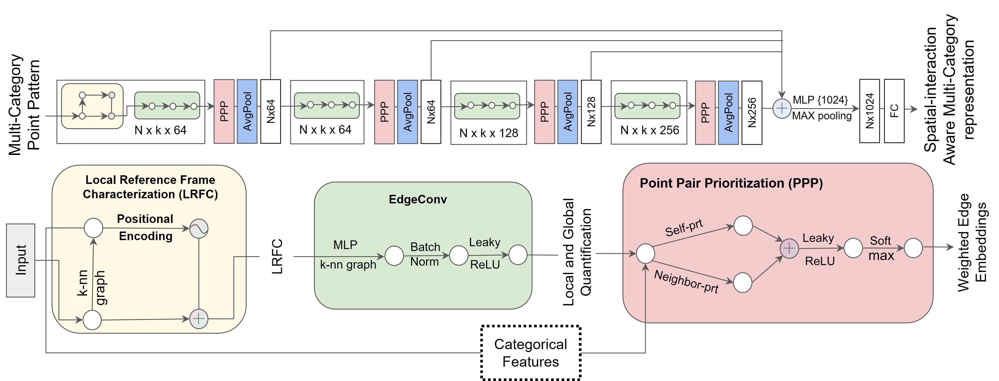

## Spatial-interaction Aware Multi-Category deep neural Network (SAMCNet)
We propose  Spatial-interaction Aware Multi-Category deep neural Network (SAMCNet) with novel desing of lcoal reference frame characterization and point pair prioritization layers for multi-categorical point patterns classification. 

## Overview
We proposes a novel neural network architecture, namely SAMCNet, to identify N-way (e.g., ter-tiary, ternary, etc.) spatial relationships.

## Model architecture

## Author's Implementations

The classification experiments in our paper are done with the pytorch implementation.

## Acknowledgement
The structure of this codebase is borrowed from [DGCNN](https://github.com/WangYueFt/dgcnn)

## Instructions

training model for ablation studies
python main.py --dataset ["trainining dataset"] --exp_name "name of the experiments" --self_neighbor [use self as first neighbor in top k -- True] --use_pe [using PE encoding]
 --num_heads'[num of attn heads to use. Set to 0 for no attn'] 

"other parameters can be passed, look at the main.py" 

### Command line to use for extracting features (SAMCnet needs to be modified at the return statement depending on which features needs to be extracted)
python main.py --dataset ["test data"] --model_path ["path to trained model"] --eval True --test_batch_size [] --k [n-way relationships]  --save_features "path to save extracted features"

## Hyperparameters:
batch_size = 7
n_rotations= 30
transformed_samples = 5
lr = 0.001
momentum = 0.9
num_points = 1024
dropout = 0.5
k = 6
num_heads = 1
use_sgd = False --> Adam
emb_dims = 1024
epochs = 200

---------------------------------------------------------------------------
Only PE -->  num_heads=0, use_pe=True, self_neighbor= True

neighbor_att --> use_pe = False, self_neighbor = False, neighbor= True

self_att --> use_pe = False, self_neighbor = True, neighbor= False

PE_self_att --> use_pe = True, self_neighbor = True, neighbor= False

PE_neighbor_att -->  use_pe = True, self_neighbor = False, neighbor= True

self_att_neighbor_att --> use_pe = False, self_neighbor = True, neighbor= True

entire_model --> default setting

--eval =True for feature extraction

## Citation
Please cite this [paper](https://dl.acm.org/doi/abs/10.1145/3534678.3539168?casa_token=_NaMw5WET6QAAAAA:uzW72DX4gxaqiwqP80FwHeuKr6jWfLPlPoz1vHsRVT-OqPFVb7eM8OP0_oBXCKYGhj5eol8AZew) if you want to use it in your work,

    @inproceedings{farhadloo2022samcnet,
      title={SAMCNet: Towards a Spatially Explainable AI Approach for Classifying MxIF Oncology Data},
      author={Farhadloo, Majid and Molnar, Carl and Luo, Gaoxiang and Li, Yan and Shekhar, Shashi and Maus, Rachel L and Markovic, Svetomir and Leontovich, Alexey and Moore, Raymond},
      booktitle={Proceedings of the 28th ACM SIGKDD Conference on Knowledge Discovery and Data Mining},
      pages={2860--2870},
      year={2022}
    }
